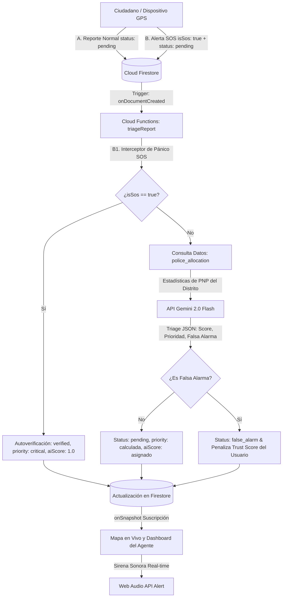

# 🛡️ Vigía 54 — Sistema Inteligente de Predicción y Reporte de Incidencias

[](https://github.com/Gustavo99400/vigia54/actions)
[](https://jestjs.io/)
[](https://nextjs.org/)
[](https://react.dev/)
[](https://firebase.google.com/)
[](https://deepmind.google/technologies/gemini/)

Plataforma inteligente (SaaS Web / PWA) orientada a la **gestión, reporte ciudadano y predicción geoespacial de la criminalidad** en Arequipa Metropolitana, Perú. El sistema integra algoritmos de reputación basados en reputación ciudadana, triaje predictivo mediante **Inteligencia Artificial Generativa** y análisis de cercanía para la toma de decisiones por parte de agentes del **Serenazgo y la Policía Nacional del Perú (PNP)**.

Construido y diseñado bajo estándares de calidad de software (**ISO/IEC 25010**) y metodologías ágiles (**Scrum**).

---

## 🗺️ Arquitectura de Flujo de Información (SOS & Reportes)



---

## 🛠️ Stack Tecnológico

| Capa / Componente | Tecnología principal | Propósito y Ventajas |
|---|---|---|
| **Frontend / Cliente** | Next.js 15.3 (App Router) | Renderizado optimizado, PWA nativo y ruteo estático de alto rendimiento. |
| **Estilos** | CSS Puro (Vanilla CSS Variables) | Máximo rendimiento gráfico sin sobrecarga de frameworks utilitarios. |
| **Biblioteca UI** | React 19.0.0 | Renderizado reactivo rápido y soporte nativo para elementos asíncronos. |
| **Estado Global** | Zustand | Almacenamiento ágil del estado de sesión, filtros de mapa y progreso ETL. |
| **Visualización** | Leaflet + leaflet.heat | Mapas dinámicos con renderizado interactivo de mapas de calor en el cliente. |
| **Estadísticas** | Recharts | Gráficos visuales interactivos de tendencias por hora, distrito y tipo de delito. |
| **Backend Serverless**| Firebase Cloud Functions (Node.js 20) | Triggers asíncronos en la nube para triaje y automatización de analíticas. |
| **Base de Datos** | Cloud Firestore | Base de datos NoSQL documental con actualizaciones asíncronas en tiempo real. |
| **Autenticación** | Firebase Authentication | Seguridad en acceso con roles usando proveedores como Google y Correo. |
| **Inteligencia Artificial**| Google Gemini 2.0 Flash API | Triaje semántico asíncrono, cálculo de prioridad y detección de spam. |
| **Calidad / Pruebas** | Jest + Testing Library | Suite de pruebas automatizadas y reporte detallado de cobertura. |

---

## 📋 Requisitos Funcionales y Especificación Técnica

### `RF1` Triaje IA con Gemini
* **Funcionamiento**: Al crearse un reporte en Firestore, se dispara una Cloud Function que consulta la distribución de fuerzas de la PNP asignadas a ese distrito (`police_allocation`). Envía esta información junto a la descripción ciudadana a Gemini 2.0 Flash. La IA devuelve un JSON estructurado con nivel de prioridad, confianza y justificación basada en la suficiencia de efectivos policiales locales.

### `RF2` Motor Predictivo e Ingesta de Calor
* **Funcionamiento**: Generación automática de mapas de calor a nivel de cliente segmentando los incidentes:
  * **Zonas Calientes (Rojo/Naranja)**: Casos pendientes, en revisión y verificados.
  * **Zonas Mitigadas (Verde)**: Casos marcados como resueltos.

### `RF3` Pipeline de Ingesta y ETL
* **Funcionamiento**: Panel administrativo para subir archivos CSV históricos de denuncias de delincuencia y despliegue policial de la PNP.
  * **Optimización**: Procesa y sube registros en lotes de 20 para evitar estrangular las cuotas gratuitas de Firestore.
  * **Georreferenciación inteligente**: Si los registros no tienen coordenadas de latitud/longitud exactas, el sistema calcula una desviación aleatoria dentro del radio real del distrito correspondiente de Arequipa Metropolitana.

### `RF4` Filtrado Geoespacial
* **Funcionamiento**: Sidebar de navegación interactivo con selectores por tipo de delito, distrito, rango horario (0-23) y filtros de fecha en tiempo real.

### `RF5` Dashboard Analítico del Agente
* **Funcionamiento**: Tablas detalladas de revisión de incidentes pendientes, panel de resolución y despacho de Serenazgo con un simulador sonoro sirena PWA implementado con **Web Audio API**.

### `RF6` Autenticación y Control de Roles
* **Funcionamiento**: Sistema granular de accesos protegido por `RoleGuard` a nivel de rutas estáticas y reglas de seguridad a nivel de base de datos para los roles de **Ciudadano**, **Agente Policial** y **Administrador**.

### `RF7` Algoritmo de Reputación (Trust Score)
* **Algoritmo**: Gestión de reputación del usuario para mitigar reportes maliciosos.
  $$\text{Trust Score} = \frac{(\text{Reportes Verificados} \times 1.0) - (\text{Falsas Alarmas} \times 5.0)}{\text{Total de Reportes}} \times 100$$
  * Si el puntaje disminuye por debajo de **30.0**, el usuario pierde el derecho a triaje automático (requiriendo revisión manual de sus envíos).

---

## 🔒 Seguridad en Base de Datos (Cloud Firestore Rules)

La base de datos está protegida bajo un principio de privilegios mínimos basado en roles:
* **Usuarios (`/users`)**: Un ciudadano ordinario solo puede leer y crear su propio documento. Únicamente puede editar campos no sensitivos (no puede modificar su propio rol, reputación o contador de alarmas falsas). Los agentes y administradores tienen acceso de lectura completo.
* **Incidencias (`/reports`)**:
  * Un ciudadano solo puede crear reportes en estado inicial `pending` (pendiente) y sin autovincularse un `aiScore`.
  * Únicamente los administradores y agentes policiales (`isStaff()`) pueden cambiar el estado del reporte a verificado o resuelto.
* **SOS (Transacción segura)**: Para evitar que un atacante simule ser policía y auto-verifique alarmas falsas, las alertas del **Botón SOS** se registran inicialmente como `pending` y con la bandera `isSos: true`. La Cloud Function intercepta la bandera en la nube y actualiza de forma segura el reporte a `verified` y `critical` usando privilegios administrativos de confianza (Admin SDK).

---

## 🧪 Demostración de Calidad (DevSecOps & CI)

### 1. Auditoría de Seguridad Automatizada
El flujo de integración continua realiza un escaneo de dependencias en búsqueda de vulnerabilidades conocidas.
Puedes ejecutarlo localmente desde cualquiera de las carpetas principales (`/web` o `/firebase/functions`):
```bash
npm audit --audit-level=high
```

### 2. Pruebas Unitarias y Cobertura (Jest)
Las funciones críticas del sistema (cálculo de reputación Trust Score, decodificación de geohashes y distancias con la fórmula de Haversine) cuentan con pruebas automatizadas Jest con una cobertura superior al **87%** en las clases core:
```bash
# Ejecutar localmente desde la carpeta /web
npm run test:coverage
```

La tabla de cobertura en consola detalla el cubrimiento completo del algoritmo en `utils/`:
```text
PASS src/utils/geo.test.ts
PASS src/utils/trustScore.test.ts
--------------------------|---------|----------|---------|---------|-------------------
File                      | % Stmts | % Branch | % Funcs | % Lines | Uncovered Line #s 
--------------------------|---------|----------|---------|---------|-------------------
All files                 |   10.61 |     4.61 |    3.78 |    8.66 |                   
 utils                    |   96.72 |    90.24 |     100 |     100 |                   
  geo.ts                  |   96.03 |    89.18 |     100 |     100 | 82-85             
  trustScore.ts           |     100 |      100 |     100 |     100 |                   
--------------------------|---------|----------|---------|---------|-------------------
```
*Además, al correr este comando se genera una carpeta `/web/coverage/lcov-report/index.html` que puedes abrir en tu navegador para auditar visualmente las líneas cubiertas.*

---

## 🚀 Despliegue en Producción

### Frontend (Next.js Estático en Hosting)
1. Compilar y exportar la aplicación Next.js:
   ```bash
   cd web
   npm run build
   ```
   Esto exporta la aplicación optimizada a la carpeta estática `web/out`.
2. Copiar los archivos estáticos en la carpeta del proyecto de Firebase (para cumplir la restricción del CLI de Firebase):
   ```bash
   # En Windows
   xcopy /s /e /y web\out firebase\web_out
   ```

### Desplegar a Firebase Cloud
Una vez que el proyecto se encuentra compilado:
```bash
cd firebase
firebase deploy
```
*Esto subirá automáticamente las reglas de seguridad de Firestore, los índices geoespaciales, las Cloud Functions y la aplicación estática a Firebase Hosting.*
