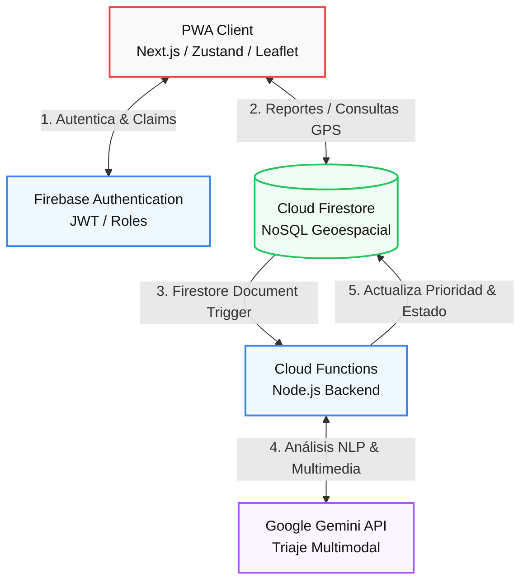
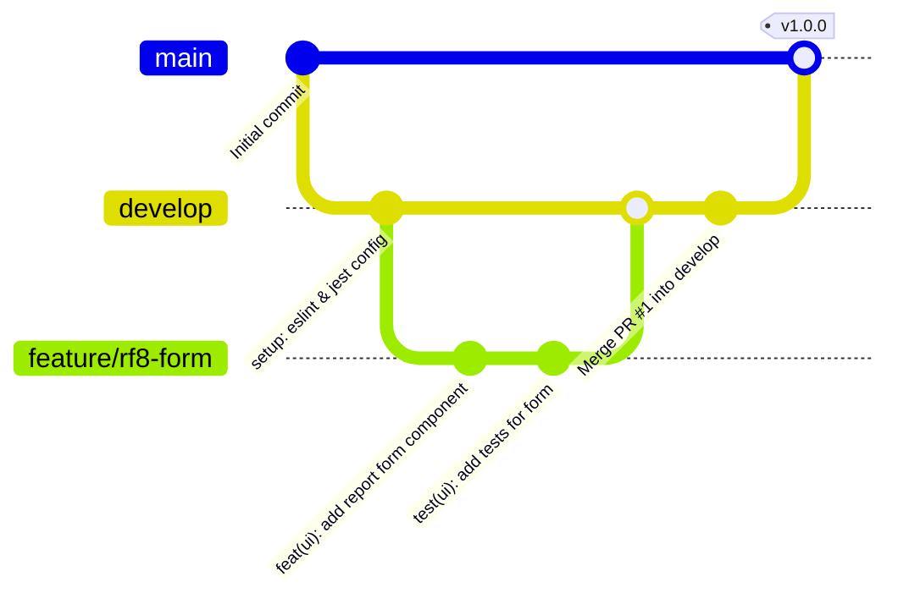
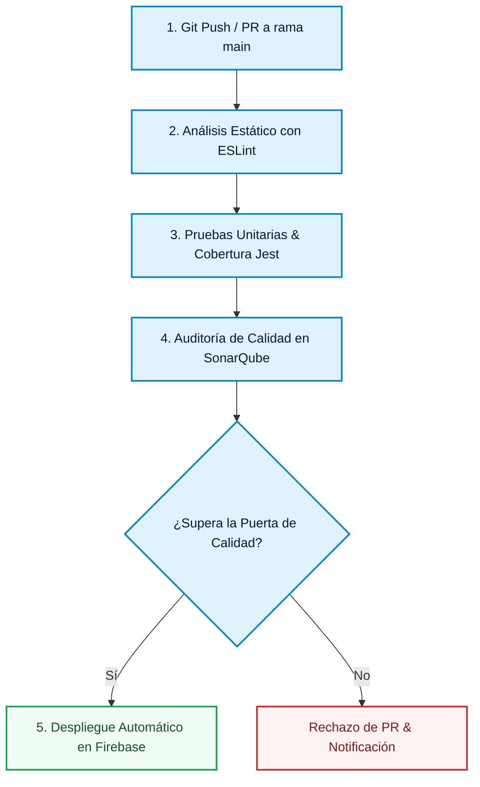

# 🛡️ Vigía 54 - Sistema Inteligente de Predicción y Reporte de Incidencias Delictivas en Arequipa

[](https://github.com/Gustavo99400/vigia54/actions)
[](https://sonarcloud.io/)
[](https://jestjs.io/)
[](https://nextjs.org/)
[](https://firebase.google.com/)

**Vigía 54** es una plataforma integral SaaS web y móvil (PWA) orientada a la gestión, reporte ciudadano colaborativo y predicción geoespacial de incidencias delictivas en la provincia de Arequipa, Perú. El sistema aprovecha la ingesta estructurada de datos abiertos gubernamentales de la Policía Nacional del Perú, procesándolos mediante modelos analíticos de clustering en la nube e incorporando un pipeline asíncrono con Inteligencia Artificial (Google Gemini) para el triaje y validación autónoma de los reportes recibidos.

Todo el ciclo de vida del desarrollo de software del ecosistema se rigió bajo el estándar de calidad internacional **ISO/IEC 25010** y el marco de trabajo ágil **Scrum**.

---

## 📌 Ejes Tecnológicos Principales

1. **Triaje Automatizado con IA (Gemini):** Procesamiento de lenguaje natural (NLP) y visión por computadora mediante la API de Google Gemini para clasificar la veracidad de los reportes en tiempo real y descartar falsas alarmas.
2. **Predicción Geoespacial:** Generación de mapas de calor interactivos probabilísticos de criminalidad basados en algoritmos de clustering y codificación geohash sobre datasets históricos.
3. **Arquitectura Cloud Nativa:** Infraestructura elástica y serverless montada sobre Google Cloud Platform (GCP) y Firebase, con funciones asíncronas en Node.js y base de datos NoSQL distribuida.

---

## ⚙️ Arquitectura de Sistemas y Flujo de Datos

El siguiente diagrama detalla la interconexión de servicios cloud serverless y el pipeline asíncrono de Inteligencia Artificial que compone el ecosistema:



---

## 📊 Mapeo del Proceso de Calidad (ISO/IEC 25010)

Para asegurar la robustez de "Vigía 54", se implementaron dinámicas transversales en el desarrollo asociadas a cuatro características clave del estándar de calidad de producto:

| Característica | Subcaracterística | Estrategia de Control | Métrica / Herramienta Aplicada |
| :--- | :--- | :--- | :--- |
| **Adecuación Funcional** | Completitud funcional | Mapeo de historias de usuario y criterios de aceptación estrictos por sprint. | Suite de pruebas unitarias con Jest (Cobertura $> 80\%$). |
| **Eficiencia de Desempeño** | Comportamiento temporal | Renderizado diferido de componentes cartográficos y geohashing compuesto en DB. | Tiempos de carga de consultas geoespaciales $< 3$~s. |
| **Mantenibilidad** | Analizabilidad / Testabilidad | Análisis estático de código, cumplimiento de linters y tipados TypeScript. | Calificación grado **A** en SonarQube (Deuda técnica $\le 0.3\%$). |
| **Seguridad** | Confidencialidad / Integridad | Cifrado TLS 1.3, anonimización de datos y Firebase Security Rules por rol de token JWT. | Políticas de acceso granulares en Firestore y Firebase Auth. |

---

## 📋 Catálogo de Requisitos del Sistema

El alcance funcional del prototipo se delimita a 8 Requisitos Funcionales catalogados por complejidad técnica y prioridad de negocio:

### 1. Requisitos Funcionales (RF)

| ID | Requisito Funcional | Descripción Técnica | Complejidad | Prioridad |
| :--- | :--- | :--- | :---: | :---: |
| **RF1** | Triaje Inteligente por IA | El sistema evalúa asíncronamente descripciones y fotos mediante la API de Google Gemini para clasificar incidentes y descartar spam. | Alta | Alta |
| **RF2** | Motor Predictivo Geoespacial | Generación probabilística de cuadrantes de criminalidad en mapas utilizando clustering y geohashes. | Alta | Alta |
| **RF3** | ETL de Datos Abiertos | Ingesta masiva y validación estructural de archivos CSV/JSON procedentes del Portal de Datos Abiertos del Perú. | Alta | Media |
| **RF4** | Consultas Geoespaciales | Segmentación de incidencias en mapa dinámico por delito, distrito de Arequipa, horario y estado. | Media | Alta |
| **RF5** | Dashboard Analítico | Consola policial que muestra gráficos interactivos agregados del comportamiento delictivo. | Media | Media |
| **RF6** | Control de Acceso por Roles | Autenticación robusta diferenciando tres perfiles (Ciudadano, Agente y Administrador). | Media | Alta |
| **RF7** | Gestión de Perfil | Permite configurar datos personales y preferencias de alertas geolocalizadas. | Baja | Media |
| **RF8** | Formulario Manual | Formulario responsivo para reportes en campo con coordenadas del GPS nativo. | Baja | Alta |

### 2. Requisitos No Funcionales (RNF)

* **RNF1 (Seguridad - Confidencialidad):** Cifrado en tránsito HTTPS y TLS 1.3. Anonimización de los campos de identidad del ciudadano en Firestore.
* **RNF2 (Eficiencia - Tiempo de Respuesta):** Tiempos de respuesta inferiores a 3 segundos para consultas geoespaciales optimizadas sobre índices compuestos.
* **RNF3 (Usabilidad - Portabilidad):** Interfaz adaptativa desarrollada como PWA móvil/desktop, contraste mínimo de 4.5:1 y cacheo local offline básico.

---

## 📅 Planificación Ágil (Scrum) y Sprints

El desarrollo del proyecto se planificó y ejecutó en **8 semanas** mediante **4 Sprints** de 2 semanas de duración cada uno. Cada miembro del equipo asumió un compromiso mínimo de **4 horas diarias** de trabajo técnico (20 horas semanales).

```text
[Sprint 1: Sem 1-2] ──► [Sprint 2: Sem 3-4] ──► [Sprint 3: Sem 5-6] ──► [Sprint 4: Sem 7-8]
  Setup, Auth (RF6)      ETL Datos (RF3)       Triaje con IA (RF1)    Motor Predictivo (RF2)
  Reporte manual (RF8)   Filtro Mapa (RF4)     Dashboard (RF5)        Pruebas de estrés
                         [Hito 1: Prototipo]                          [Hito 2: Software Final]
```

---

## ⚙️ Políticas de Gestión de Configuración (SCM)

### 1. Modelo de Ramas (Git Flow Adaptado)
El proyecto utiliza un flujo de ramificación ordenado para garantizar que la rama `main` siempre represente el estado estable de producción:



* **`main`**: Rama protegida. Solo recibe fusiones de código estabilizado y aprobado desde `develop` al final de cada Sprint.
* **`develop`**: Rama base de integración de características.
* **`feature/<rf-id>-<nombre>`**: Ramas de desarrollo de requisitos (e.g. `feature/rf1-triaje-ia`).
* **`hotfix/<nombre-parche>`**: Parches urgentes para la rama principal.

### 2. Convención de Mensajes de Commit
Se adoptó el estándar de **Conventional Commits**:
* `feat(alcance): descripción` (para nuevos requisitos, e.g. `feat(auth): configure firebase user roles`)
* `fix(alcance): descripción` (corrección de errores, e.g. `fix(map): resolve Leaflet marker overlap`)
* `test(alcance): descripción` (añadir suites de pruebas, e.g. `test(functions): add unit tests for Gemini handler`)
* `docs(alcance): descripción` (documentación, e.g. `docs(scm): update project README`)
* `chore(alcance): descripción` (mantenimiento, e.g. `chore(deps): update dependency packages`)

---

## 🛡️ Flujo del Pipeline CI/CD (Quality Gates)

Cada Pull Request hacia la rama `main` dispara automáticamente el pipeline de GitHub Actions configurado en `.github/workflows/main.yml`, validando el cumplimiento del *Quality Gate* antes del despliegue:



---

## 🏆 Resultados de Aseguramiento de Calidad y Pruebas

Los resultados del análisis del pipeline de calidad demostraron una excelente adherencia a los estándares y una baja deuda técnica:

### 1. Métricas de Análisis Estático (SonarQube)

| Métrica Auditada | Criterio / Umbral de Aceptación | Resultado Obtenido | Calificación |
| :--- | :--- | :---: | :---: |
| **Bugs** | 0 bugs críticos y bloqueantes en el código. | **0** | **Grado A** |
| **Vulnerabilidades** | 0 fallos de seguridad detectados. | **0** | **Grado A** |
| **Code Smells** | Menos de 15 incidencias menores de código. | **8** | **Grado A** |
| **Duplicación** | Tasa de duplicación de líneas $< 3.0\%$. | **0.4%** | **Aprobado** |
| **Deuda Técnica** | Tiempo estimado de remediación $< 5.0\%$. | **0.3%** | **Grado A** |

### 2. Reporte de Cobertura de Código (Jest Test Suite)

El plan de testing abarca pruebas sobre los componentes del cliente, los ganchos de estado de Zustand y el backend serverless de Cloud Functions:

| Módulo del Sistema | Cobertura de Líneas | Cobertura de Ramas | Cobertura de Funciones | Estado |
| :--- | :---: | :---: | :---: | :---: |
| Componentes de Interfaz | $82.3\%$ | $75.0\%$ | $85.0\%$ | Aprobado |
| Servicios y Estado (Zustand) | $91.2\%$ | $88.9\%$ | $100.0\%$ | Aprobado |
| Cloud Functions (IA Pipeline) | $88.5\%$ | $80.0\%$ | $90.0\%$ | Aprobado |
| **Promedio Global** | **87.33%** | **81.30%** | **91.67%** | **Aprobado** |

---

## 🚀 Guía de Instalación y Despliegue Local

### Requisitos Previos
* **Node.js** v20.x o superior.
* **Firebase CLI** instalado globalmente (`npm install -g firebase-tools`).

### Configuración del Frontend
1. Navega al directorio `web/`:
   ```bash
   cd web
   ```
2. Instalar paquetes de dependencias:
   ```bash
   npm install
   ```
3. Configura las variables de entorno de Firebase en un archivo `.env.local` en la raíz de `web/`:
   ```env
   NEXT_PUBLIC_FIREBASE_API_KEY=tu_api_key
   NEXT_PUBLIC_FIREBASE_AUTH_DOMAIN=tu_auth_domain
   NEXT_PUBLIC_FIREBASE_PROJECT_ID=tu_project_id
   NEXT_PUBLIC_FIREBASE_STORAGE_BUCKET=tu_storage_bucket
   NEXT_PUBLIC_FIREBASE_MESSAGING_SENDER_ID=tu_sender_id
   NEXT_PUBLIC_FIREBASE_APP_ID=tu_app_id
   ```
4. Levanta el servidor de desarrollo local:
   ```bash
   npm run dev
   ```
5. Abre la aplicación en [http://localhost:3000](http://localhost:3000) y la presentación en [http://localhost:3000/presentacion](http://localhost:3000/presentacion).

### Configuración del Backend (Cloud Functions)
1. Navega al directorio del backend:
   ```bash
   cd ../firebase/functions
   ```
2. Instala dependencias y compila el código TypeScript:
   ```bash
   npm install
   npm run build
   ```
3. Inicia el simulador de base de datos y funciones locales:
   ```bash
   firebase emulators:start
   ```

### Ejecutar Pruebas Automatizadas
Para correr el suite de pruebas Jest y generar el reporte HTML de cobertura:
```bash
cd web
npm run test
# Reporte detallado de cobertura
npm run test -- --coverage
```
